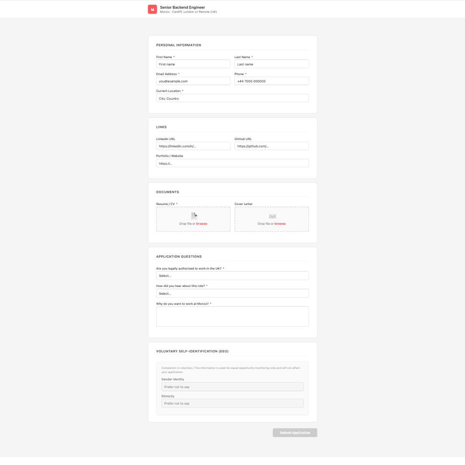

# career-agent

**Agentic job application workflow for Claude Code and Cowork.**

One command generates a tailored CV + cover letter PDF per role. Claude fills the ATS form. You review and click Submit.

Not a template engine. Not a job tracker. An agent that does the work.

**[📖 Live Demo & Docs](https://nextwebb.github.io/career-agent/)** | **[⭐ Star on GitHub](https://github.com/nextwebb/career-agent)**



---

## What it does

1. **`/source`** — Find and verify open roles matching your profile from company career pages
2. **`/new-role`** — Scaffold a new role config interactively by scraping the JD
3. **`/generate-cv`** — Build ATS-optimised CV + cover letter PDFs tailored to the role
4. **`/apply`** — Open the job URL in Chrome, fill every required field, upload PDFs, answer custom questions — then hand off to you for EEO/voluntary fields and Submit
5. **`/track`** — View your application pipeline, update statuses, add notes

Claude never submits on your behalf. That boundary is intentional.

---

## Why this is different

| | career-agent | job-application-quality | career-ops |
|---|---|---|---|
| Browser form filling | ✅ Greenhouse, Lever, Workable | ❌ | ❌ |
| Per-role tailored PDF | ✅ | ✅ basic | ❌ |
| CV variant system | ✅ A/B/C by role type | ❌ | ❌ |
| Cover letter per role | ✅ | ❌ | ❌ |
| Human-in-loop handoff | ✅ EEO + Submit | N/A | N/A |
| Profile data local | ✅ gitignored | varies | varies |
| Cowork + Claude Code | ✅ both | ❌ | ❌ |

---

## Prerequisites

- [Claude Code](https://claude.ai/code) or [Cowork](https://claude.ai) desktop app
- Python 3.10+ with `reportlab` (`pip install reportlab`)
- [Claude in Chrome extension](https://chrome.google.com/webstore) connected to Cowork/Claude Code

---

## Quick start

```bash
git clone https://github.com/nextwebb/career-agent
cd career-agent
cp profile.example.json profile.json      # fill in your details
cp roles.example/example_role.json roles/my_role.json  # fill in the role
pip install reportlab
```

Then in Claude Code or Cowork:

```
/new-role                    # Interactively create a role config
/generate-cv my_role         # Generate tailored PDFs
/apply my_role               # Fill the ATS form
/track                       # View your application pipeline
```

---

## Profile setup

`profile.json` (gitignored — never committed) holds your personal data:

```json
{
  "name": { "first": "Jane", "last": "Doe" },
  "email": "jane@example.com",
  "phone": { "country_code": "+1", "number": "5551234567" },
  "location": "Berlin, Germany",
  "relocation": "Open to EU/UK relocation with visa sponsorship",
  "links": {
    "linkedin": "https://www.linkedin.com/in/janedoe/",
    "github": "https://github.com/janedoe",
    "website": "https://janedoe.dev",
    "twitter": "https://x.com/janedoe"
  },
  "headline": "Senior Software Engineer — Python · Distributed Systems · AI",
  "summary": "7+ years building production Python systems..."
}
```

See `profile.example.json` for the full schema.

---

## Role config

Each role lives in `roles/<role_id>.json` (gitignored):

```json
{
  "role_id": "stripe_backend_2026",
  "company": "Stripe",
  "title": "Senior Backend Engineer",
  "url": "https://stripe.com/jobs/listing/...",
  "ats_platform": "greenhouse",
  "variant": "C",
  "cover_letter": {
    "paragraphs": [
      "Stripe's payment infrastructure serves...",
      "My background in distributed systems...",
      "...",
      "I would welcome a conversation..."
    ]
  },
  "custom_answers": {
    "why_company": "...",
    "hear_about_us": "LinkedIn"
  }
}
```

See `roles.example/example_role.json` for the full schema including CV bullet overrides.

---

## CV variants

Define named variants in `profile.json` under `"variants"`. Each variant emphasises a different slice of your experience:

- **A** — AI/LLM/Evaluation focused
- **B** — Data Platform/Pipelines focused  
- **C** — Senior Backend/APIs focused

The role config picks a variant. The CV builder selects the matching experience ordering and impact statements.

---

## ATS platform support

| Platform | Fill fields | Upload resume | Custom questions |
|---|---|---|---|
| Greenhouse (direct) | ✅ | ✅ | ✅ |
| Greenhouse (iframe embed) | ✅ via embed URL | ✅ | ✅ |
| Lever | ✅ | ✅ | ✅ (text) |
| Workable | ✅ | ✅ | ✅ |
| More | PRs welcome | | |

---

## Install as plugin

### Cowork (desktop)

1. Open Cowork → Settings → Plugins
2. Click **Install from folder** → select this repo root
3. Skills appear as `/source`, `/new-role`, `/generate-cv`, `/apply`, `/track`

### Claude Code (CLI)

```bash
# In your project or home directory
cp -r skills ~/.claude/skills/career-agent
```

Then in any Claude Code session:
```
/career-agent:apply my_role
```

Or add to your project's `CLAUDE.md`:
```
@~/.claude/skills/career-agent/apply/SKILL.md
```

---

## Human-in-the-loop handoff

Claude fills every required field it can verify from your profile and the role config. It does **not**:

- Click Submit
- Fill EEO/voluntary self-identification fields (gender, race, veteran status, disability)
- Enter passwords or credentials

This is a deliberate design boundary, not a limitation. The agent flags exactly what it has filled and what remains for you.

---

## Project structure

```
career-agent/
├── README.md
├── CLAUDE.md                        # Claude Code context + slash commands
├── plugin.json                      # Cowork + Claude Code plugin manifest
├── requirements.txt                 # pip install reportlab
├── profile.example.json             # Copy → profile.json (gitignored)
├── .gitignore
│
├── skills/
│   ├── source/SKILL.md              # Find + verify open roles from your profile
│   ├── new-role/SKILL.md            # Scaffold a new role JSON interactively
│   ├── generate-cv/SKILL.md         # Build PDF from profile + role config
│   ├── apply/SKILL.md               # Fill ATS form + upload + handoff
│   └── track/SKILL.md               # Application pipeline tracker
│
├── src/
│   ├── cv_builder.py                # reportlab Platypus PDF engine
│   ├── cl_builder.py                # Cover letter PDF builder
│   ├── generate_application.py      # CLI: python src/generate_application.py <role_id>
│   └── tracker.py                   # Pipeline tracker CLI
│
├── roles.example/
│   └── example_role.json            # Role config schema reference
│
├── roles/                           # gitignored — your role configs
├── generated/                       # gitignored — output PDFs
├── tracker.json                     # gitignored — application pipeline
└── profile.json                     # gitignored — your profile data
```

---

## Contributing

ATS platforms to add: Ashby, SmartRecruiters, Taleo, iCIMS, BambooHR.

Each platform needs:
- A `src/ats/<platform>.py` helper (optional — for complex flows)
- Notes in the `apply` skill about platform-specific quirks (hidden file inputs, React comboboxes, cross-origin iframes, etc.)

Open an issue before starting to avoid duplication.

---

## License

MIT
